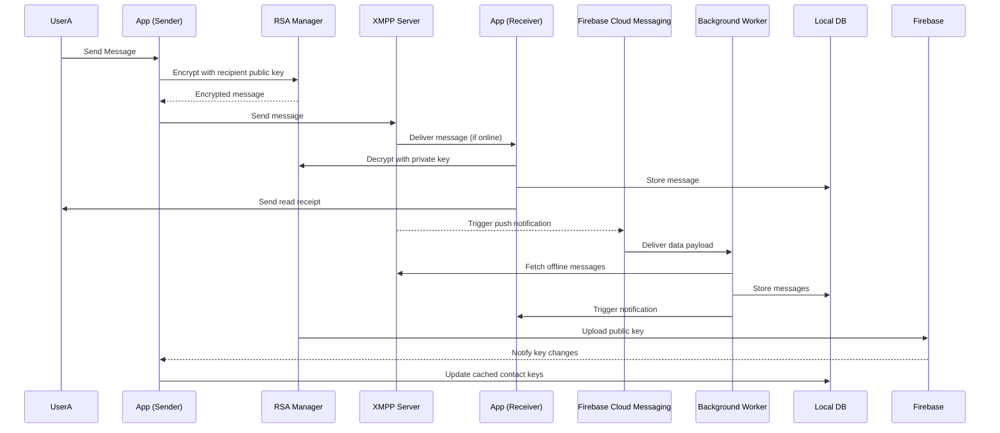

# Android Chat App

## Overview

> ⚠️ **Note:** This project was developed as part of a university capstone.  
> While it demonstrates core concepts in messaging, security, and mobile development, it does **not reflect my current engineering practices or experience**.  
> Since completing this project, I have gained 6+ years of professional experience in software engineering and architecture, working with more modern patterns, tools, and production-scale systems.

This application is an Android-based chat platform that enables users to send messages using the XMPP protocol. It integrates real-time messaging, user presence, configurable notifications, and optional end-to-end encryption.

---

## Features

### Messaging & Presence
- Real-time messaging via XMPP
- Message status indicators:
  - Sent
  - Delivered
  - Read
- Typing indicators (optional)
- Presence visibility:
  - Online
  - Away
  - Offline

### Background Processing & Message Sync
- Firebase Cloud Messaging (FCM) integration for push notifications
- Intelligent job handling:
  - Short tasks handled immediately
  - Long-running tasks delegated to WorkManager
- Background synchronization includes:
  - Retrieval of offline messages (1:1 and group chat)
  - Contact updates (vCard changes)
  - Avatar cache invalidation

### Offline Message Handling
- Offline messages retrieved via background worker upon notification
- Uses temporary authentication tokens to securely reconnect to XMPP server
- Messages are processed and stored locally, then surfaced via notifications

### Media & Profile Updates
- Avatar updates handled via cache invalidation (Picasso)
- Contact metadata (vCard) updates synchronized in background

### Notification Controls
- **User-defined "Available Hours"**
  - Full notifications during active hours
  - Silent notifications outside of defined time ranges
- Conversation-level muting
- Global group chat muting
- Fully silent chats (no notifications at all)

### Privacy Controls
- Optional disabling of:
  - Read receipts
  - Typing indicators
- Contacts can view availability windows and presence status
  - Users appear offline outside their defined availability hours

---

## Security

### End-to-End Encryption (Optional)
- RSA-based encryption
- Public keys stored in Firebase Realtime Database
- Private keys stored securely using Android Keystore

### Key Management
- RSA key pair generated and stored in Android Keystore
- Automatic public key synchronization with Firebase
- Real-time updates of contact public keys via Firebase listeners
- Local caching of contact keys for encryption performance

### Transport Security
- All XMPP traffic secured via SSL/TLS
- Certificates provided by Let's Encrypt

### Application-Level Security
- Biometric authentication (fingerprint)
- Screenshot blocking (best effort, device/OS dependent)

---

## Local Data Storage (Room Database)

The application uses Android Room as a local persistence layer to support offline functionality, caching, and efficient data access.

### Design Overview
- Room is used as the primary local data source
- A repository pattern abstracts database access from the rest of the application
- Data is normalized across multiple entities and relationship tables

### Key Capabilities
- **Offline-first behavior**
  - Messages, contacts, and metadata are stored locally
  - Enables message access and UI rendering without immediate network calls

- **Relational Data Modeling**
  - Complex relationships are represented using join tables and DAO compositions:
    - Users ↔ Settings
    - Users ↔ Status
    - Contacts ↔ Availability
    - Chat Sessions ↔ Messages
    - Group Chats ↔ Participants

- **Granular DAO Structure**
  - Separate DAOs for:
    - Users and contacts
    - Chat sessions and messages
    - Status and availability
    - Group chat relationships
  - Promotes modular access and separation of concerns

- **Repository Abstraction**
  - A centralized `Repository` layer coordinates all database operations
  - Used across encryption, messaging, and background workers

### Synchronization Strategy
- Local database is continuously synchronized with:
  - Firebase Realtime Database (e.g., public keys, tokens)
  - XMPP server (messages, presence, offline retrieval)
- Background workers update local state after receiving push notifications

### Notes / Limitations
- Schema design reflects early-stage modeling and could be simplified with modern approaches
- Lacks more advanced patterns such as paging, caching strategies, or reactive streams (e.g., Flow)

## Architecture

### Backend Components
- **Openfire XMPP Server** for message routing and presence
- **Embedded Ktor server** for custom backend logic and extensions. It was embedded into the Openfire XMPP Server

### Related Repositories
- Openfire modifications:  
  https://github.com/cmmcmm9/OpenfireServer

- Ktor embedded server plugin:  
  https://github.com/cmmcmm9/Openfire-Plugin
  
## Architecture Overview

The following diagram illustrate the high-level system architecture, message flow, and local data model.

---

## Technical Notes / Limitations

- Encryption implementation is simplified and not production-grade by modern standards
- Architecture reflects early-stage design decisions and learning-phase tradeoffs
- Some platform limitations (e.g., screenshot prevention) depend on Android OS behavior
- The project is not actively maintained

---

## Why This Project Still Matters

This project highlights:
- Early experience with distributed messaging systems (XMPP)
- Implementation of client-side encryption concepts
- Mobile UX considerations around notifications and availability
- Backend integration with real-time communication systems

---

## Looking Forward

While I am not actively maintaining this project, my current work focuses on:
- Leveraging Kotlin Multiplatform for use across Mobile, Web, Desktop, and Server targets
- Scalable backend systems
- Modern architectures (microservices, event-driven systems)
- Cloud-native development
- Production-grade security practices
